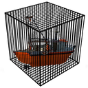
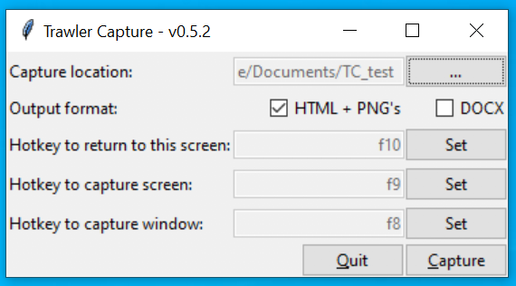
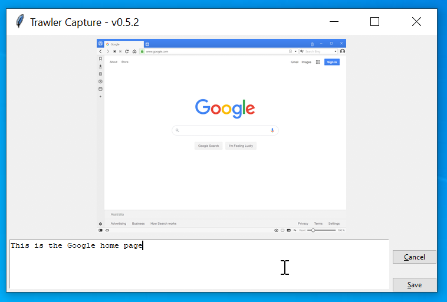

# TrawlerCapture

## About

TrawlerCapture is a screenshot tool to make exploratory testing easier, it's name came from the original requirement:
> _A simple tool that can be used when trawling through an application you press a HotKey, take a screen shot of the screen and also associate some text with the screenshot._

Here is the main screen of TrawlerCapture:

On this screen you configure the output location, the type of output you want and the hotkeys, as you change the settings the ini file is automatically updated so your choices will be remembered.

- The HTML + PNG's format will create a html file that you can open with a web browser to see the screenshots formatted nicely with the comments you typed, in the same folder as the html file will be the individual screenshots as PNG files. This mode is useful if you need compatibility or want to publish to a web site quickly.

- The DOCX format will create a MS Word document (docx) as a single file, the screenshots will be embedded in the document. This mode is useful for emailing and attaching to bug tracking systems. For compatibility, the generated docx file can also be opened with [LibreOffice](https://www.libreoffice.org).

To start capturing press the "Capture" button, but first make sure you remember what the hotkeys are, because TrawlerCapture will be hidden once the capturing starts.

If you press the return hotkey the main TrawlerCapture screen will reappear and the capture mode will stop.

If you press one of the capture hotkeys the preview screen will appear:

The preview screen shows a preview of the screenshot and lets you add a description in the text box below the preview, when you are happy with your description, press save to continue capturing.

If you press the cancel button in the preview screen, the screenshot shown will not be included in the output, and you will be returned to capture mode.

## Installation

There is no need to install anything as TrawlerCapture binaries are distributed as a single executable.

## Bugs and Feature Requests

If you find a bug in TrawlerCapture or simply would like a feature added please use our [issue tracker](https://github.com/damies13/TrawlerCapture/issues) and create a new issue if one doesn't already exist.

If there is already an issue created for something you were going to raise, give the existing issue a thumbs up, so we know more people are interested in this issue.

## Donations

If you would like to thank me for this project please use this [PayPal.me](https://paypal.me/damies13/5) link, the $5 is a suggestion, feel free to change to any amount you would like.

If you do make a donation and would like me to prioritise a feature / issue send me a [quick message](mailto:damies13+rfswarm@gmail.com) and let me know.
